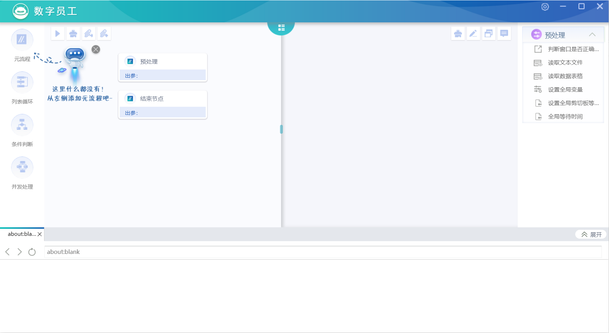

# II-RPA
		不需要安装，不需要注册，纯开源，纯代码，无限制，自由使用研究，只要感兴趣，都可以尝试，
		有想法问题可以及时沟通，看到即回，

#### II-RPA：Infinite intelligence RPA，人力有限，而智慧无穷，

#### 介绍关于RPA，流程自动化机器人，
		流程机器人是一个模拟人进行逻辑判断和操作应用的软件程序。它结合人工智能的应用实现工作流程的自动化，主要由两部分能力组成，
		一部分是软件应用的操作能力，模拟人进行软硬件的操作；
		另一部分是人工智能的能力，模拟人类进行语义识别、图像识别、逻辑判断等。
		流程机器人通过两部分能力的组合在应用系统上辅助人类完成复杂的业务流程。
		通俗点说，可以用流程机器人，以无代码方式，通过拖动窗口，输入信息，实现一些爬虫啊，自动化办公啊，自动操作系统的一系列功能,
		凡事那种每天都要在电脑上操作的重复，量大的工作，都可以用这个工作自动完成，

#### 安装依赖

		1、简单方式，这边为了方便大家启动项目，把项目依赖打了个压缩包，方便大家使用，本地已测试，是没问题的，有问题及时反馈，一起研究。天翼云和网盘都上传了，看大家需求，
		下载依赖路径，
		   1、天翼云，https://cloud.189.cn/t/ueuERniuYVny (访问码:6q3z)，
		   2、网盘，链接：https://pan.baidu.com/s/1-R1UIRr70Cd27ruHJ5ZTbA ，提取码：h1j9 

		2、麻烦点的方式，自行安装依赖，大概需要注意的步骤如下，本地测试也是可以的。有问题及时反馈，一起看下。（本地环境是win10系统的）
		   1、确保路径不能有中文，主要是安装opencv时会提示异常，
		   2、Admin方式启动PowerShell，执行npm install --global windows-build-tools， 
		   3、配置python27环境变量，
		   4、安装目录python27\Lib\site-packages下新增sitecustomize.py，
		      写入配置，
		      # encoding='GBK' 
		      import sys  
		      reload(sys)  
		      sys.setdefaultencoding('GBK')  
		   5、npm install -g node-gyp， 
		   6、对应npm命令执行目录下，新增binding.gyp文件， 
		      写入配置，
		      { 
		        "targets": [ 
		          {
		            "target_name": "binding", 
		            "sources": [ "src/binding.cc" ] 
		          } 
		        ] 
		      } 
		   7、执行npm config edit， 
		      写入配置，
		      electron_mirror=https://npm.taobao.org/mirrors/electron/
		   8、执行node-gyp configure，如果已经有build目录，要手动删掉，
		   9、前往https://github.com/nodejs/node-gyp#on-windows下载并安装 Visual Studio Build Tools， 
		   10、项目根目录下，新增src目录，src目录下，新增binding.cc空文件， 
		   11、前往https://cmake.org/download/下载对应cmake安装包并安装， 
		   12、配置cmake环境变量， 
		   13、在admin-powershell下执行 Get-ExecutionPolicy -List查看权限，执行 Set-ExecutionPolicy RemoteSigned -Scope CurrentUser赋予权限，
		   14、执行git config --global http.postBuffer 88880000， 
		   15、执行git config --global http.sslVerify "false"， 
		   16、执行npm config edit， 
		      写入配置，
		      node_sqlite3_binary_host_mirror=http://npm.taobao.org/mirrors 
		   17、opencv会经常出现有文件下载遗漏的问题，其它依赖已经处理完成，本地下载有时候会提示文件遗漏，可以自己单独去下，然后放进去就可以了，
		      可以试下vpn多次尝试下载，
		      可以先删掉opencv依赖，后续单独下载移包进来，对应opencv代码已注释，
		      等包好了，可以自行放开，opencv主要使用在识别验证码处，看大家需求，如果不用到识别这块，可以先注释掉，
		   18、执行npm install

#### 启动教程
		cnpm start
		启动后的样子，

		看到它，基本就ok了，

#### 测试文件（可直接读取使用）
		新增测试流程文件，直接读取通过rpa程序可读取测试，
		路径为：./rpa测试流程文件/*.rpa
		
#### 开发者相关

		技术框架，
		前端：Html，
		外壳：Electron，
		中间件：Nodejs，
		后续扩展：python（内置python，用axios的httpclient模式，去请求python服务方式，）

#### 项目结构目录

		Package.json------模块描述文件，
		Webpack.config.js------Webpack执行配置文件，
		Main.js------主js入口，
		Obfuscator.js------Javascript代码压缩与混淆，
		gulpfile.js------前端自动化构建工具，浏览器刷新，
		node_modules------依赖目录，
		interiorConfig，
		   menu.json------配置组件菜单，
		   properties.json------默认配置，快捷键，全局等待时间，中英文，版本号，日志目录，超时时间，远程端口，之类，
		   version.json------迭代版本信息，
		extend------扩展组件目录，
		config------i18n主要是中英文配置，
		build------构建目录，
		app------主要项目目录，
		css------css样式目录，
		img------静态资源目录，
		main------主进程代码 ，核心部分，
		pages------对应所有页面，
		renderer------渲染进程代码，核心部分，
		tool------工具目录，
		   uiautomation------uispy，微软提供的UI自动化库，
		   log------日志配置，及存放目录，
		renderer.js------electron渲染配置，

#### 软件截图

     
     

#### 后续迭代计划，

		1、新增python的兼容扩展，
		2、新增selenium模块全浏览操作组件，
		3、新增钩子，

#### rpa官网介绍，

		官网地址：http://rpaii.com/index.html
		如果在使用rpa上有什么问题，也可以留言发表评论，
		下面是官网介绍：
		全面智能官网是全面智能科技有限公司网络门户。官网基于用户角度，为用户解答了什么是RPA，RPA能给我们带来什么的问题，还在此基础之上，详尽的介绍了全智天行RPA的AI及其他技术优势、特点，并提供了RPA学习和交流的平台。
		官网的解决方案模块，将我们过往丰富的项目经验，区分行业、通用、个人三个类型，为用户罗列了RPA的实际应用场景，以便用户更加具体的了解全智天行RPA。
		全面智能官网RPA学院模块，以视频方式，为用户提供各类基础入门功能的学习和项目的典型应用场景视频。
		全面智能官网支持社区模块，搭建了一个开放共享的RPA交流社区，便于用户反馈使用之中遇到的各类问题，我们将在第一时间回复您的疑问及需求。
		全面智能官网提供了一个让用户了解RPA，学习RPA，分享RPA经验的开放平台，以求促进全面智能不断优化完善，努力为用户提供更好更稳定的服务。

#### Rpa商业产品介绍，

		全智天行简介
		全智天行（流程自动化机器人），通过模拟人进行逻辑判断，以及读取和操作任意软件应用系统，实现工作流程中的自动化。
		全智天行有设计器、执行器、控制中心三个部分组成，设计器提供流程设计编排能力，执行器提供任务执行能力，控制中心则是机器人及任务执行的集中控制管理平台。
		全智天行核心能力，一是软件应用操作能力，实现高适用的模拟人进行软硬件操作。 二是人工智能能力，模拟人进行语义识别，图像识别，逻辑判断等等。通过两部分能力的组合能够在应用系统上辅助人类完成繁杂的业务流程。
		全智天行产品价值
		1、提升工作效率：实现7*24小时工作，全年无休；
		2、提升工作质量：避免人为失误，处理正确性达到100%；
		3、控制企业成本：降低50-60%的人力或外包成本；
		4、安全合规：每个任务步骤都可以被监控和记录；
		5、可扩展性和灵活性：拖拉拽的流程设计，方便用户快速部署。
		全智天行技术优势
		1、全组件化流程引擎技术
		2、端到端机器人集群控制技术
		3、多模态界面认知技术
		4、异步自动执行技术
		5、多进程异常处理技术
		6、智能提取技术
		7、视觉处理技术

#### 沟通讨论，
		电子邮箱：opensource@rpaii.com

		后续也会开通更多沟通方式，